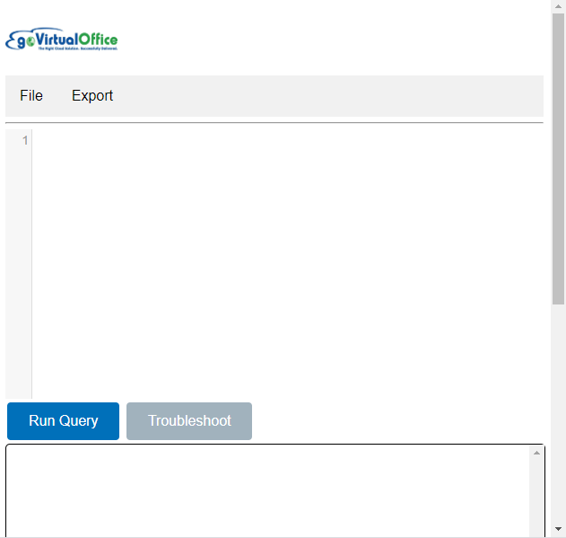
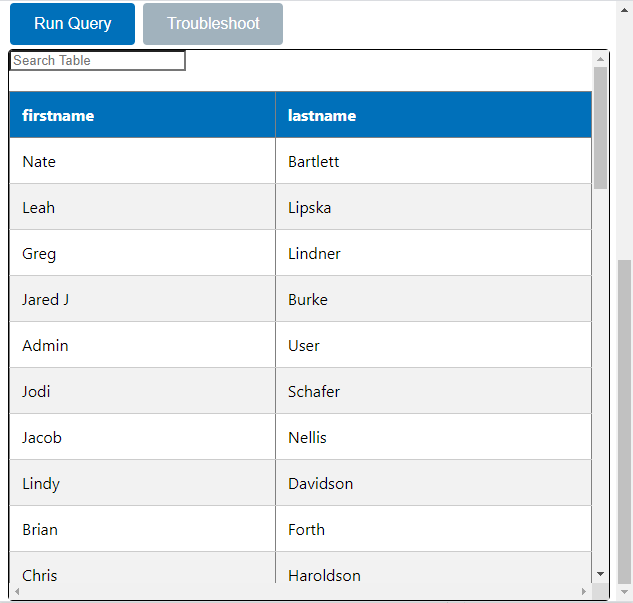

<h1 style='text-align: center;'> Netsuite Query Extension </h1>

**Version:** 1.0.0.0

**Created By:** Jacob Nellis / goVirtualOffice LLC

## **Table of Contents**
---

- [Introduction](#introduction)
- [Getting Started](#getting-started)
- [Shortcuts](#shortcuts-and-important-notes)
- [Credits/Acknowledgements](#credits-and-acknowledgements)

## **Introduction**
---

The Netsuite Query Tool by goVirtual office provides a simple and conveinient way to create and share queries across all your Netsuite accounts. When opened within a netsuite scriptable record, the extension will provide automatic type checking based on the netsuite accounts record catalog.

Queries can be tested and saved from within the extension, and results can be downloaded to both CSV and JSON formats.

## **Getting Started**
---
Clicking on the extension will bring up the following popup window:

The extension acts like a simple IDE when opened within a scriptable record. Typing will bring up suggestions for table names and field names when using a dot join on a table. A suggestion can be applied by using the arrow keys to find the suggestion, and then pressing 'Tab'. The will complete the word and also display information about the table or field in the message box below the editor.

The File tab can be used to save and load queries, and the export tab can convert results into a downloadable CSV or JSON file.

## **Shortcuts and Important Notes**
---

### Typing Suggestions

#### Table and Field Suggestions
When the extension is initially loaded, it will first pull in all table names from the Netsuite account you have open. Once you have typed your first table name, this will trigger a function that will search for the field names in that table. You can then see the fields available by placing a '.' after the table name.

**EXAMPLE:**

    transaction.<field name>
    
    // field suggestions will not appear
    // unless you explicitly specify the table 
    // you are using with the . operation

**Note:** If you don't get field suggestions right-away, you may need to wait a few seconds for the names to get loaded in.

**Note:** Suggestions can be enabled-disabled with 'Ctrl+Space'

#### Table Aliases
Fields can still be found from tables that have been givin aliases, but it's important that the alias is defined using all caps 'AS' in the query. Defining a table alias any other way will prevent the extension from recognizing which table you are trying to get fields from.

**Working example**

    // Editor will be able to suggest the field name
    SELECT
        trans.<fieldname>
    FROM
        transaction AS trans

**Not Working Examples**

    // Editor will not be able to suggest field name
    SELECT
        trans.<fieldname>
    FROM
        transaction trans
    
    // another bad query
    SELECT
        trans.<fieldname>
    FROM
        transaction as trans
    

#### Netsuite Functions
It's also common to use SuiteQL's builtin functions as a part of your query. To see these keywords, you can type 'FUNC' into the editor. This will bring up the different types of Netsuite enumerations. Selecting an option with 'Tab' will then open up the keywords associated with that catagory.

### Running your Query
Pressing 'Run-Query' will execute a query using the 'N/Query' module in netsuite. This will produce either a table of results, or an error, and will display in the message box below the IDE.

A search bar is provided that will automatically scroll to the text you are trying to find. Pressing 'enter' will bring you to the next set of matching keywords.

## **Contact Information**
---

This extension is provided by goVirtualOffice. We are an award-winning NetSuite provider helping companies enhance productivity, improve efficiency and grow profits by unifying, simplifying and automating business processes. We've become one of the top NetSuite consulting companies in the world. You can find us at our <a href="https://goVirtualOffice.com">website</a>.

For feature request/bug reports, please email jnellis@govirtualoffice.com

## **Credits and Acknowledgements**
---

This extension was inspired by Tim Dietrich's <a href="https://timdietrich.me/netsuite-suitescripts/suiteql-query-tool/">SuiteQL Query tool</a>.
